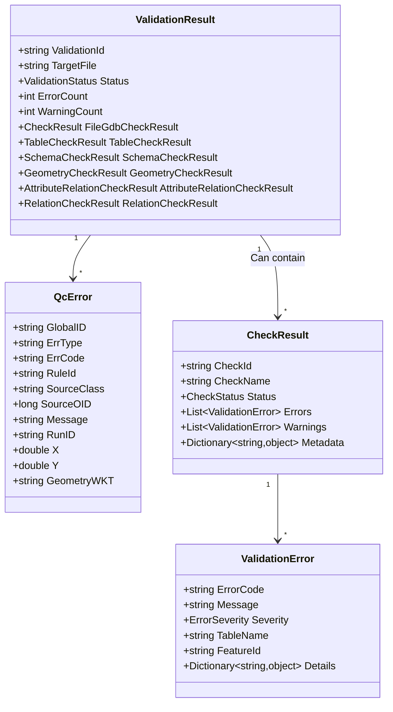
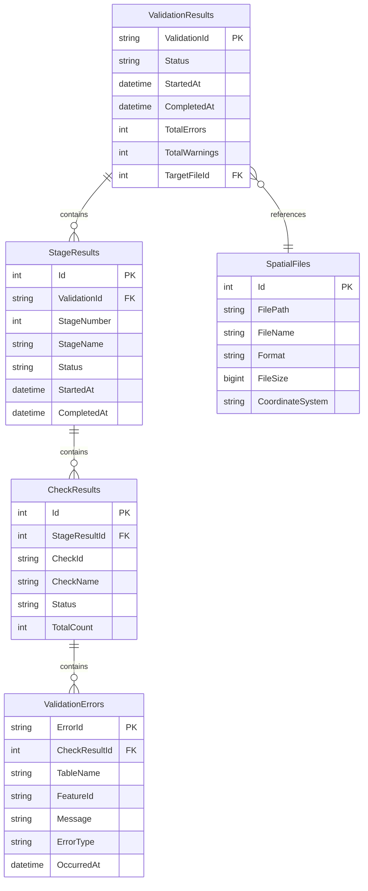
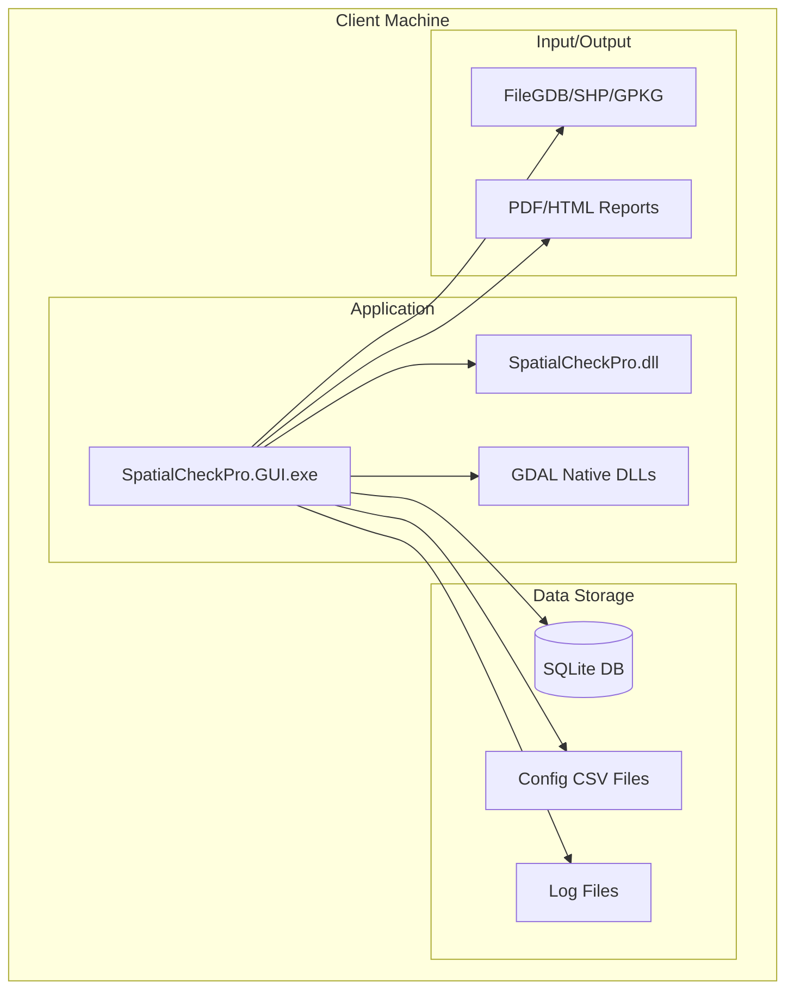
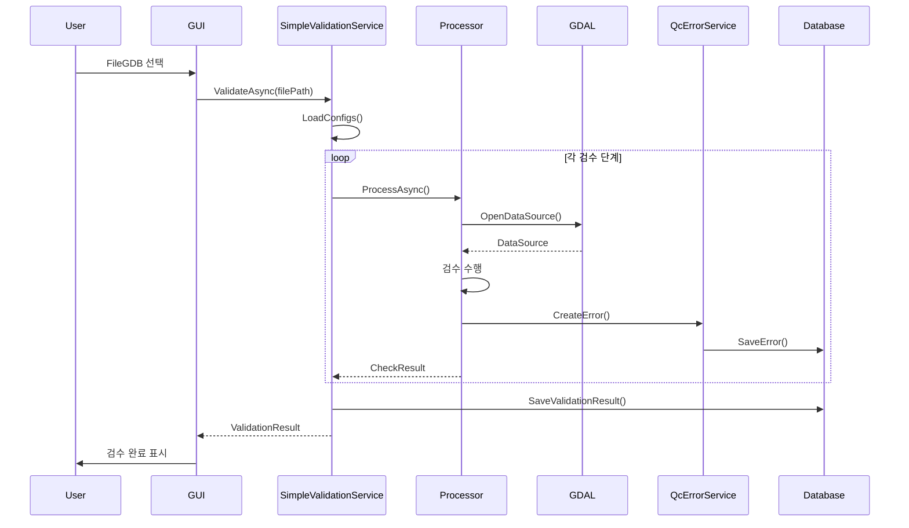
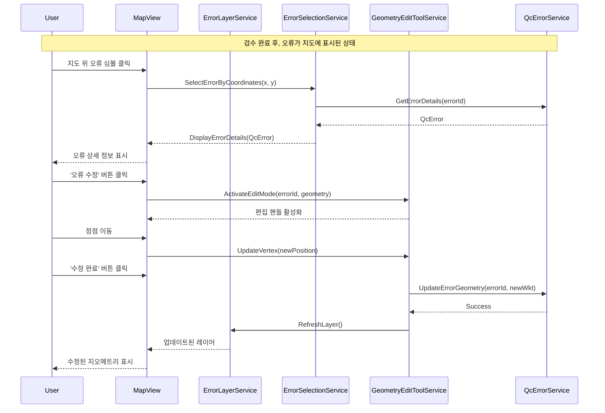

# SpatialCheckPro 아키텍처 다이어그램

## 1. 시스템 컴포넌트 다이어그램

```mermaid
graph TD
    subgraph "Presentation Layer (GUI)"
        Views[Views / XAML]
        ViewModels[ViewModels]
        subgraph "GUI Services"
            SVS[SimpleValidationService]
            %% 지도 관련 서비스(미사용)는 문서에서 제외
        end
    end
    
    subgraph "Application Logic"
        subgraph "Core Processors"
            TCP[TableCheckProcessor]
            SCP[SchemaCheckProcessor]
            GCP[GeometryCheckProcessor]
            RCP[RelationCheckProcessor]
            ACP[AttributeCheckProcessor]
        end
        
        subgraph "Core Services"
            GdalService[GdalDataAnalysisService]
            QcErrorService[QcErrorService]
            ReportService[ReportService]
            AuditService[AuditLogService]
            RuleEngine[ConditionalRuleEngine]
        end

        subgraph "Performance & Resource Services"
            APM[AdvancedParallelProcessingManager]
            SPM[StageParallelProcessingManager]
            CRM[CentralizedResourceMonitor]
            SRA[SystemResourceAnalyzer]
            AMM[AdvancedMemoryManager]
            DCS[DataCacheService]
        end
    end
    
    subgraph "Data Access Layer"
        subgraph "Data Providers"
            DataProvider[IValidationDataProvider]
            GdbProvider[GdbDataProvider]
            SqliteProvider[SqliteDataProvider]
        end
    subgraph "Pools"
        DataSourcePool[DataSourcePool]
    end
        subgraph "Configuration"
            CsvConfigService[CsvConfigService]
        end
        subgraph "Spatial Indexing"
            SIM[SpatialIndexManager]
            RTree[RTreeSpatialIndex]
            QTree[QuadTreeSpatialIndex]
        end
    end
    
    subgraph "Infrastructure"
        FileSystem[(File System: GDB, CSV)]
        Database[(SQLite / FGDB QC_ERRORS)]
        Logger[Microsoft.Extensions.Logging + FileLoggerProvider(UTF-8)]
    end

    Views --> ViewModels
    ViewModels --> SVS

    SVS --> TCP & SCP & GCP & RCP & ACP
    SVS --> APM & SPM & CRM & DataProvider
    
    TCP & SCP & GCP & RCP & ACP --> GdalService
    TCP & SCP & GCP & RCP & ACP -- uses --> SIM
    GdalService --> DataSourcePool
    
    CRM --> SRA
    SPM --> APM
    
    DataProvider -- Implements --> GdbProvider & SqliteProvider
    
    QcErrorService --> Database
    ReportService --> Database
    DataSourcePool --> FileSystem
    CsvConfigService --> FileSystem
```

### 업데이트(신규)
- Stage 4/5: `RelationErrorsIntegrator`가 원본 FGDB에서 지오메트리를 추출하여 X/Y/WKT를 채워 저장
- 겹침: `SpatialIndexService.FindOverlaps`가 교차 지오메트리를 반환하고, `HighPerformanceGeometryValidator`가 중심점/WKT를 사용해 오류 위치 정확도 향상

## 2. 검수 프로세스 플로우

```mermaid
flowchart TD
    Start([시작]) --> SelectFile[FileGDB 선택]
    SelectFile --> AutoHP{자동 HP 판단\n(파일크기/피처수)}
    AutoHP -->|임계 초과| ModeHP[고성능 모드 활성화]
    AutoHP -->|미만| ModeNormal[일반 모드]
    ModeHP --> ConvertToSqlite[GDB to SQLite 변환]\n(SqliteDataProvider=OGR)
    ModeNormal --> LoadGdb[GDB 직접 로드]
    
    ConvertToSqlite -->|실패시| LoadGdb
    
    ConvertToSqlite --> LoadConfig
    LoadGdb --> LoadConfig[검수 설정 로드<br/>CSV 파일]
    
    LoadConfig --> Stage0{0단계: FileGDB 완전성 검사}
    Stage0 -->|실패| Error0[오류 보고]
    Stage0 -->|성공| ParallelExecution{검수 단계 실행<br/>(순차/병렬)}
    
    subgraph ParallelExecution
        direction LR
        Stage1[1. 테이블 검사]
        Stage2[2. 스키마 검사]
        Stage3[3. 지오메트리 검사]
        Stage4[4. 속성 관계 검사]
        Stage5[5. 공간 관계 검사]
    end
    
    ParallelExecution --> |오류 발생| ErrorLog[오류 기록]
    ErrorLog --> QcErrors
    ParallelExecution -->|성공| QcErrors[QC_ERRORS 생성]
    
    Error0 --> Report
    QcErrors --> SaveDB[(SQLite 저장 또는 FGDB QC_ERRORS)]
    SaveDB --> Report[보고서 생성<br/>PDF/HTML]
    Report --> End([완료])
```

## 3. 클래스 다이어그램 (핵심 모델)



## 4. 의존성 주입 구조

```mermaid
graph LR
    subgraph "Service Container"
        DI[ServiceCollection]
    end
    
    subgraph "Singleton Services"
        direction LR
        subgraph "Core Infrastructure"
            CSV[CsvConfigService]
            GDAL[GdalDataAnalysisService]
            QES[QcErrorService]
            DSP[DataSourcePool]
            GDC[GdbToSqliteConverter]
            AS[AuditLogService]
        end
        subgraph "Performance"
            APM[AdvancedParallelProcessingManager]
            SPM[StageParallelProcessingManager]
            CRM[CentralizedResourceMonitor]
            SRA[SystemResourceAnalyzer]
            AMM[AdvancedMemoryManager]
            DCS[DataCacheService]
            SIM[SpatialIndexManager]
        end
    subgraph "GUI Infrastructure"
        MAIN[SimpleValidationService]
        RS[ReportService]
    end
    end
    
    subgraph "Scoped/Transient Services"
        GVS[GeometryValidationService]
        SVS[SchemaValidationService]
        VDP[IValidationDataProvider]
        RuleEngine[ConditionalRuleEngine]
    end

    subgraph "Processors"
        ITP[ITableCheckProcessor]
        ISP[ISchemaCheckProcessor]
        IGP[IGeometryCheckProcessor]
        IRP[IRelationCheckProcessor]
        IAP[IAttributeCheckProcessor]
    end
    
    DI --> "Core Infrastructure" & "Performance" & "GUI Infrastructure"
    DI --> "Scoped/Transient Services"
    DI --> "Processors"
    
    MAIN -- uses --> ITP & ISP & IGP & IRP & IAP
    MAIN -- uses --> "Performance"
    MAIN -- uses --> VDP
    MAIN -- uses --> QES & GDAL & GDC
```

> 참고: AdvancedParallelProcessingManager는 상위에서 할당된 operationId를 공유하여 진행률/성능 집계를 일관되게 처리합니다.

## 5. 데이터베이스 스키마



## 6. 배포 다이어그램



## 7. 시퀀스 다이어그램 (검수 실행)



## 7. 시퀀스 다이어그램 (오류 시각화 및 수정)


